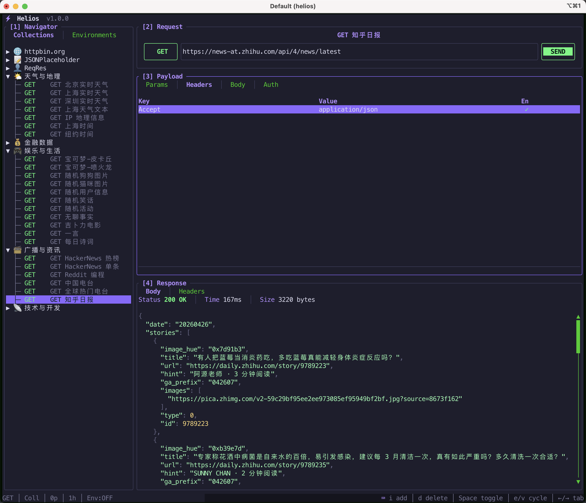

# Helios ⚡

> A blazing-fast terminal API client, crafted for **macOS**.

[](https://www.apple.com/macos/)
[](https://www.rust-lang.org/)

Helios is a terminal-based HTTP client inspired by Postman, rebuilt for speed and keyboard-driven workflows. Designed with a neon-themed TUI that feels at home in any macOS terminal — whether you use **Terminal.app**, **iTerm2**, **Warp**, or **Kitty**.



---

## Why Helios on Mac?

- **Native performance** — Rust binary, zero runtime dependencies, launches instantly
- **Keyboard-first** — Every action has a shortcut; no mouse required
- **Beautiful in dark mode** — Deep navy surface with neon purple accents, perfect for macOS Dark Mode terminals
- **Data lives in `~/Library/Application Support`** — Follows Apple guidelines, easy to back up with Time Machine
- **Works with your existing tools** — Use alongside curl, httpie, or your IDE; import/export Postman Collections

---

## macOS Installation

### Option 1: One-line Install (Recommended)

```bash
git clone <repo> ~/helios && cd ~/helios && ./install.sh
```

### Option 2: Make

```bash
make install
```

### Option 3: Manual

```bash
cargo build --release
sudo cp target/release/helios /usr/local/bin/
```

### Uninstall

```bash
make uninstall
# or
sudo rm /usr/local/bin/helios
rm -rf ~/Library/Application\ Support/com.helios.helios
```

---

## Quick Start

```bash
# Launch the interactive TUI
helios

# Or send a request directly from the command line
helios send GET https://httpbin.org/get
```

---

## TUI Overview

Helios TUI is organized into 4 panes with a dynamic shortcut bar at the bottom:

### Pane Switching

| Key | Action |
|-----|--------|
| `m` + `1/2/3/4` | Jump to pane by number (Sidebar / URL Bar / Payload / Response) |
| `F1` / `F2` / `F3` / `F4` | Alternative pane switch (when `m+num` is not available) |
| `Tab` / `Shift+Tab` | Cycle focus forward / backward |
| `Ctrl+Q` / `Ctrl+C` | Quit |

> The `m` key enters **prefix mode** — you have ~2 seconds to press `1-4` to switch panes. The bottom bar shows context-aware shortcuts for the current pane.

---

## Pane Reference

### [1] Navigator — Sidebar

Three tabs: **Collections** (`1`) / **History** (`2`) / **Environments** (`3`)

**Collections tab:**

| Key | Action |
|-----|--------|
| `↑` / `↓` | Navigate items |
| `→` / `←` | Expand / collapse collection |
| `Enter` | Load selected request into URL Bar & Payload |
| `d` | Delete selected collection or request (with confirmation) |
| `Ctrl+N` | Create new collection |
| `Ctrl+R` | Create new request (blank) |

**History / Environments tabs:**

| Key | Action |
|-----|--------|
| `↑` / `↓` | Navigate |
| `Enter` | Load history item / activate environment |

### [2] Request — URL Bar

| Key | Action |
|-----|--------|
| `↑` / `↓` | Cycle HTTP method (GET → POST → PUT → DELETE → PATCH → HEAD → OPTIONS) |
| `u` | Edit URL |
| `Enter` | Send request |

### [3] Payload

Four tabs: **Params** (`p`) / **Headers** (`h`) / **Body** (`b`) / **Auth** (`a`)

| Key | Action |
|-----|--------|
| `←` / `→` | Switch tabs |
| `n` | Add new row (Params / Headers) |
| `d` | Delete selected row (Params / Headers) |
| `Space` | Toggle enable / disable |
| `e` | Edit key (Params) / Cycle preset key (Headers) |
| `v` | Edit value (Params) / Cycle preset value (Headers) |
| `t` | Cycle body type (Body) / Cycle auth type (Auth) |

> **Headers** use preset cycling: press `e` to cycle through `Content-Type`, `Accept`, `Authorization`, etc. Press `v` to cycle matching values. This avoids typo-prone free-text input.

### [4] Response

| Key | Action |
|-----|--------|
| `↑` / `↓` | Scroll 1 line |
| `PgUp` / `PgDn` | Scroll 10 lines |
| `Ctrl+U` / `Ctrl+D` | Scroll half page |
| `g` / `G` | Jump to top / bottom |
| `y` | Copy current tab content to clipboard (Body or Headers) |
| `←` / `→` | Toggle Body / Headers tab |

---

## Collections & Requests

### Save behavior

- **Load existing request** → modify → `Ctrl+S` → **updates the original request in place**
- **Create new request** (`Ctrl+R`) → edit → `Ctrl+S` → **adds as a new request** to the selected collection

### Workflow

```
Ctrl+N              Create a collection
↑/↓ + Enter         Load a request to edit
u + edit URL        Modify the request
h + e/v             Set headers
Ctrl+S              Save (update if loaded from collection, else add new)
```

---

## CLI Commands

```bash
# Send a request
helios send GET https://api.example.com/users
helios send POST https://api.example.com/users -H "Content-Type:application/json" -b '{"name":"test"}'

# Manage collections
helios collection add "My API"
helios collection list
helios collection addreq "My API" GET https://api.example.com/users
helios run "My API"

# Manage environments
helios env add "dev"
helios env set "dev" base_url "https://api.dev.example.com"

# Import / Export

Helios supports **Helios native JSON** and **Postman Collection v2.1** formats.

### CLI (Recommended for import)

```bash
# Export a collection to Helios JSON (default)
helios export "My API" --format json --output backup.json

# Export to Postman format
helios export "My API" --format postman --output my_api.postman_collection.json

# Export to stdout (no --output)
helios export "My API" --format json

# Import a collection (auto-detect format)
helios import ./backup.json
helios import ./collection.postman_collection.json --format postman

# Force format
helios import ./file.json --format json
```

### TUI (Export only)

1. Select a collection in the Sidebar (`[1] Navigator`)
2. Press **`Ctrl+E`**
3. Enter format: `json` or `postman`
4. File is saved to current directory as `{request_name}.json`

> TUI currently does **not** support import — use the CLI `helios import` command.

### Format Comparison

| Format | Extension | Use Case | Compatibility |
|--------|-----------|----------|---------------|
| `json` | `.json` | Full-fidelity backup | Helios only |
| `postman` | `.postman_collection.json` | Share with Postman/Insomnia users | Postman v2.1 |

### Data File Location

All data is stored in a single JSON file:
```
~/Library/Application Support/com.helios.helios/data.json
```

You can also back up, sync, or version-control this file directly.

---

## Data Storage

Helios stores all data locally following macOS conventions:

```
~/Library/Application Support/com.helios.helios/data.json
```

Easy to back up, sync, or version control.

---

## Tech Stack

- [Rust](https://www.rust-lang.org/)
- [ratatui](https://github.com/ratatui-org/ratatui) — Terminal UI framework
- [crossterm](https://github.com/crossterm-rs/crossterm) — Cross-platform terminal manipulation
- [reqwest](https://github.com/seanmonstar/reqwest) — HTTP client
- [tokio](https://github.com/tokio-rs/tokio) — Async runtime
- [clap](https://github.com/clap-rs/clap) — CLI argument parser

---

## Project Structure

```
helios/
├── Cargo.toml
├── Makefile
├── install.sh
├── README.md
├── USER_GUIDE.md
└── src/
    ├── main.rs          # Entry point: CLI / TUI dispatch
    ├── cli.rs           # CLI argument definitions
    ├── models.rs        # Core data structures (Request, Collection, etc.)
    ├── storage.rs       # Data persistence (JSON)
    ├── http_client.rs   # HTTP request execution
    ├── export_import.rs # Helios JSON & Postman v2.1 import/export
    ├── utils.rs         # Utility functions (JSON format, clipboard)
    └── tui/
        ├── mod.rs        # TUI main loop
        ├── app.rs        # Application state & business logic
        ├── shortcuts.rs  # Keyboard shortcuts module (centralized)
        ├── events.rs     # Event routing (delegates to app methods)
        └── ui.rs         # Pure rendering code
```

### Architecture principles

| Module | Responsibility | Rule |
|--------|---------------|------|
| `app.rs` | Business logic, data operations, state mutations | No input event handling |
| `events.rs` | Event routing: maps key → `Action` → `app` method call | No direct data manipulation |
| `shortcuts.rs` | Centralized shortcut definitions & help text | No side effects |
| `ui.rs` | Pure rendering, read-only access to `app` state | No state mutations |

---

## License

MIT
